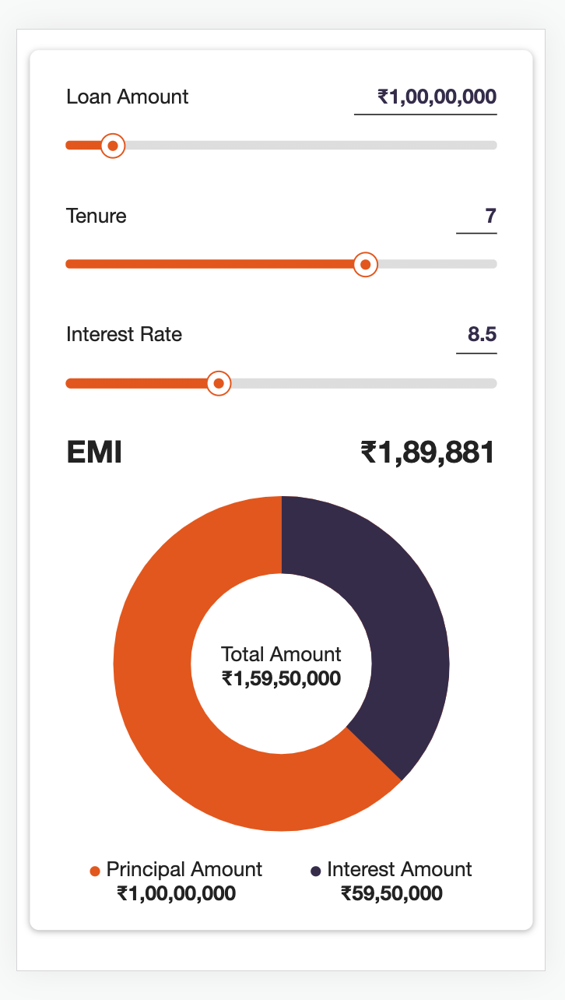

# EMI Calculator

## Table of Contents

- [Overview](#overview)
- [App Demo](#app-demo)
- [App Screenshots](#app-screenshots)
- [Highlights](#highlights)
- [Run Project](#run-project)

## Overview

**EMI Calculator** is an application that allows its users to calculate the monthly EMI on a loan amount `P` taken for a tenure of `T` years with `R` rate of interest. Besides the monthly EMI, the users also get to know the total interest to be paid by them over the given time period. The breakup of loan amount and the total interest to be paid is shown in a pictorial representation in the form of a donut chart.

The application has rich sliders and input text boxes which the users can utilize to provide inputs for loan amount, tenure and rate of interest.

The interest calculated is based on the simple interest.

## App Demo

Click the following link to view the application demo:

[Play with Demo](https://srishti-emi-calculator.netlify.app)

## App Screenshots

**Large Screen**


**Small Screen**


## Highlights

1. The application is responsive to devices of all sizes.

2. All numbers corresponding to currency are displayed with India's currency symbol (INR) before them and the number is converted to [Indian Number System](https://en.wikipedia.org/wiki/Indian_numbering_system).

3. The calculation of interest per month in the assignment document does not take tenure (in years) into consideration. The **revised formula for calculating interest per month** used in the application is as follows:

   ```
   Total Interest (Simple Interest) = P * R * T * 0.01
   ```

   ```
   Interest per month = Total Interest / (T * 12)

   Interest per month = (P * R * 0.01) / 12
   ```

   The difference lies in the fact that the denominator should be `12` rather than the number of months in the total tenure.

4. **Debouncing** is applied on all input text boxes to encourage a user to type in a value before validating it and throwing an error.

   Imagine a scenario where the existing rate of interest in the input field is `8.5`. Now, if the user tries to delete `5`, the user is not allowed to do so without allowing debouncing because the `8.` will be an invalid number and hence the event will be prevented from taking place.

   Debouncing gives a user a chance to input valid values (which may not be valid at the moment but is valid at a later point) without throwing unnecessary errors and hence non-required validations.

5. The input **range validation** is done for keeping the values within the range. If the user tries to provide a value outside the given range (i.e., the input value is either less than the minimum value or greater than the maximum value), then the input value will be set to the either of the range points (minimum value or maximum value in given range).

   For example, if the range allowed for rate of interest is `[5, 15]` and the user tries to enter the rate of interest in text box as `3`, then the value will be converted to `5` which is the minimum value allowed. Similarly, an input value of `20` as rate of interest will be converted to `15` which is the maximum value allowed. Any value between the given range (extremities being inclusive) are allowed to be entered by the user.

6. **Input validations** are applicable on all input text boxes for principal amount, tenure and interest rate.

   The principal amount text box only accepts numbers, backspace key for correction, left and right arrow keys for movement of the cursor.

   Similar validations (as applied on principal amount text box) are allowed on the tenure text box too.

   The textbox for interest rate accepts only numbers as well as a decimal digit.

7. The **interest rate** input box **rounds off** the input value to **nearest step** value (0.1 in current application).

   For example, if the input value is `8.76` in the interest rate field, the value will be rouneded off to `1` place after the decimal making the updated value as `8.7`.

8. The principal amount input text box maintains the **caret position** (last cursor position of user) for a better user experience owing to possibility of a large value inside it.

## Run Project

1. Install [Node.js](https://nodejs.org/en/) on your machine.
2. Open your Terminal, go inside the project directory and run the following command:
   ```bash
   npm i
   ```
3. Run the following command inside the project directory in your Terminal:

   ```bash
   npm start
   ```

4. Open the following URL on your browser:

   [http://localhost:3000](http://localhost:3000)

5. **Right click on the browser page and click on 'Inspect Element' to open Developer Tools in the browser. Then click on 'Toggle Device Toolbar' icon to view the project on a mobile screen. (The shortcut key to view the mobile screen after opening Developer Tools in Chrome browser is Cmd + Shift + M on macOS machine).**  
   Select any mobile device and play with the project.
